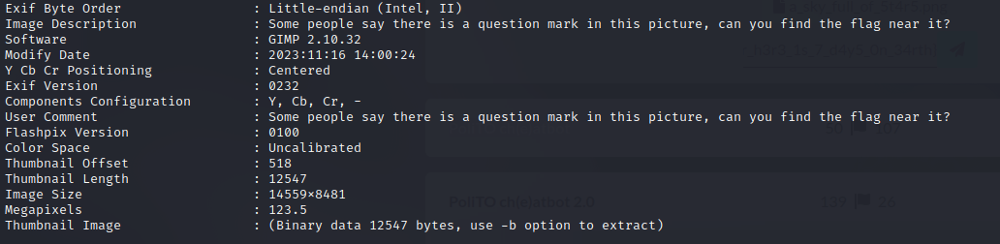
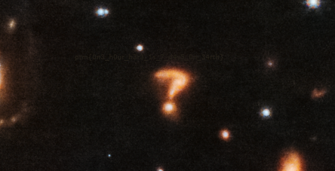

# A sky full of 5t4r5

### Challenge Information
* Description:Deep space photos are amazing!

### Solution

To solve this challenge, I ran ```exiftool``` command to search for hidden informations in the metadata. There are hints about the flag at the image description and user comemnts.

<p align="center">
  
</p>
<br>

At first I can't quite see the flag, so I ramp up the brightness of my screen and finally I can read the flag.
<p align="center">
  
</p>

### Flag
The flag for this challenge is ```ptm{0n3_h0ur_h3r3_1s_7_d4y5_0n_34rth```.
