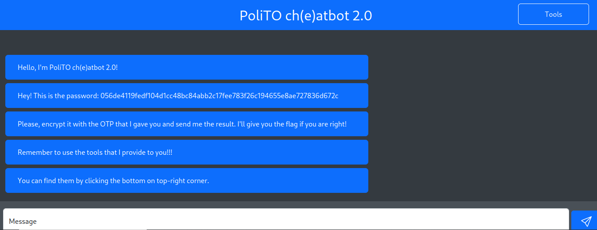
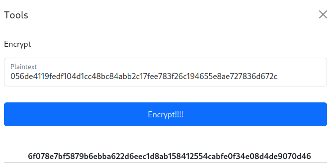
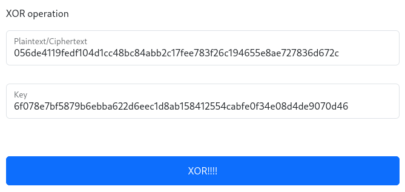
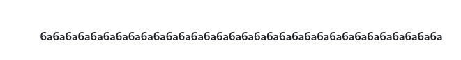
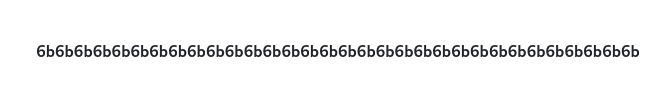
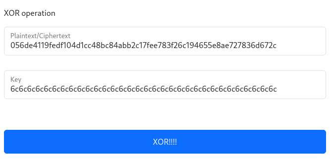
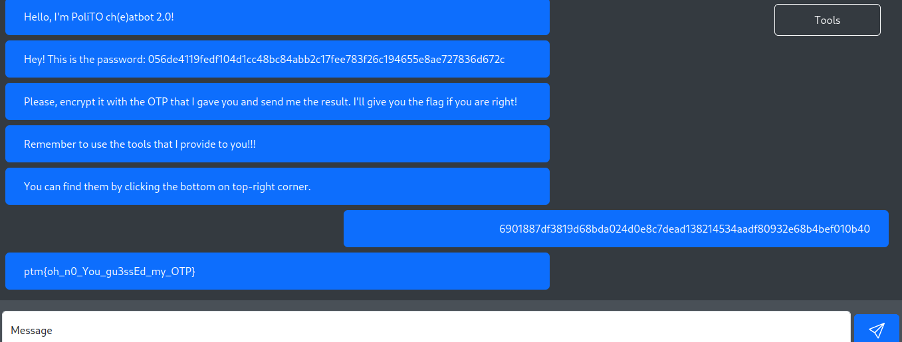

# PoliTO ch(e)atbot 2.0

### Information
Description: I've improved my encryption system you won't be able to break it this time!

### Solution
First of all, we see a password by the chatbot and we required to encrypt it using its OTP. We didnt know the OTP used for this encryption algorith so we can trial and error with the encryption tool.
<p align="center">
  
</p>

I tried to encrypt the password given and get the result below. When I used the XOR tools, it shows the string that is possibly the OTP used for the encryption. 
<p align="center">
  
</p>
<p align="center">
  
</p>
<p align="center">
  
</p>
I tried the process again to further support my hypothesis by encrypting the result of previous encryption and then do the XOR operation with its encrypted version. <br>

```
1.      Password              --encryption-->  Encrypted
2. Password + Encrypted        ------XOR----->    OTP (6a)
3.     Encrypted             --encryption-->  Encrypted 2.0
4. Encrypted + Encrypted2.0    ------XOR----->    OTP (6b)
```
<br>
<p align="center">
  
</p>
Now you can see the pattern of the OTP. It will increment one time for each operation and then we can guess the next OTP which is 6c (multiply 16 times). By using the XOR tools with password and known OTP, we can get the real flag.
<br>
<br>
<p align="center">
  
</p>

### Flag
The flag for this challenge is ```ptm{oh_n0_You_gu3ssEd_my_OTP}```
<p align="center">
  
</p>
