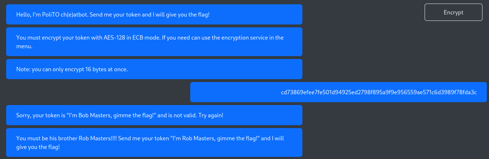
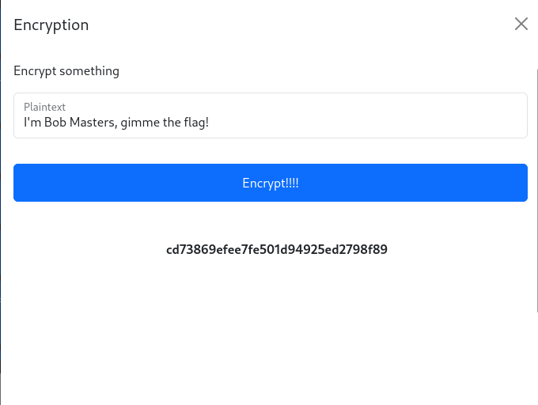
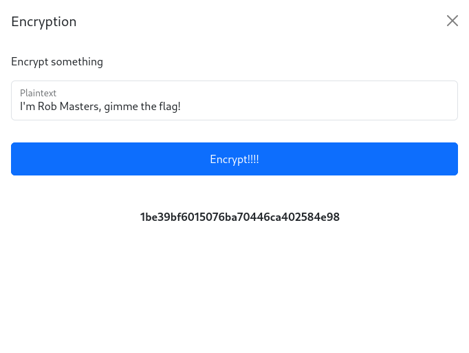
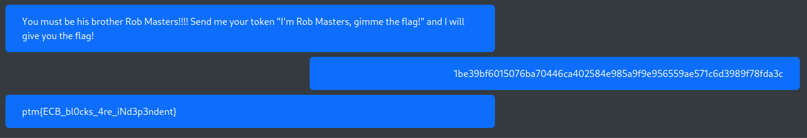

# PoliTO ch(e)atbot

### Challenge Information
* Description: All my messages are encrypted with my secret key, will you be able communicate with me?

### Solution
We can see some chat messages with the AI chatbot. There is an encrypted message from the user and the chatbot replied that we must use ```Rob Masters``` token, not Bob Masters.
<p align="center">
  
</p>
<br>

This is the result when I encrypted ```I'm Bob Masters, gimme the flag!``` and the result seems similar with what we see earlier.
<p align="center">
  
</p>
<br>

So, I tried to enter  ```I'm Rob Masters, gimme the flag!```. 

<p align="center">
  
</p>
<br>

However, the chatbot requires us to enter 64 characters message or else it will gives an error. The encrypted token is only 32 characters so we need to find the remaining 32 characters.

By examining and comparing the result from previous chats and encrypted token, we can see the 32 characters that are missing, ```5a9f9e956559ae571c6d3989f78fda3c```

Append the last 32 characters to the encrypted ```Rob Masters``` token and send to the chatbot.

<p align="center">
  
</p>
<br>

### Flag
The flag for this challenge is ```ptm{ECB_bl0cks_4re_iNd3p3ndent}```.
