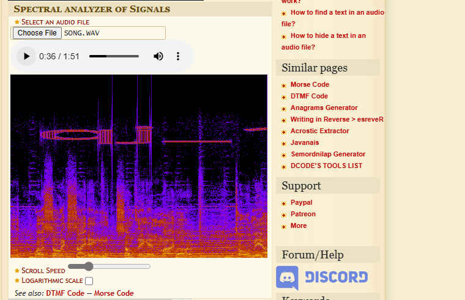

# Strangers in the Noise

### Information
* Description: My friend is an ancient tunes collector. Yesterday he downloaded this old gem but it doesn't sound quite right. Can you help him find what's wrong?

### Solution                     
When I see a ```.wav``` file, I immediately think of steganography. So, I tried with ```binwalk``` but it didnt give any result.

Then, I tried to use <a href="https://www.dcode.fr/spectral-analysis">spectogram analyzer</a> online.

<p align="center">
  
</p>
