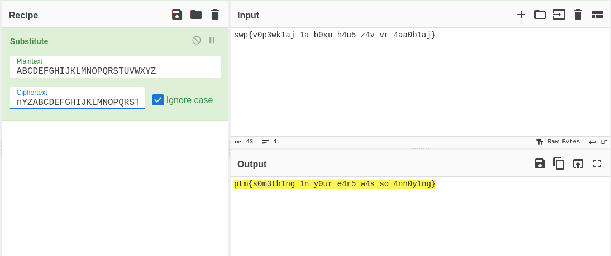

# Strangers in the Noise

### Information
* Description: My friend is an ancient tunes collector. Yesterday he downloaded this old gem but it doesn't sound quite right. Can you help him find what's wrong?

### Solution                     
When I see a ```.wav``` file, I immediately think of steganography. So, I tried with ```binwalk``` but it didnt give any result.

Then, I tried to use <a href="https://www.dcode.fr/spectral-analysis">spectogram analyzer</a> online.

<p align="center">
  
</p>

Extract all of the letters and decrypt it using <a href="https://gchq.github.io/CyberChef/">Cyberchef</a>.
<p align="center">
  
</p>

### Flag

The flag for this challenge is ```ptm{s0m3th1ng_1n_y0ur_e4r5_w45_s0_4nn0y1ng}```
